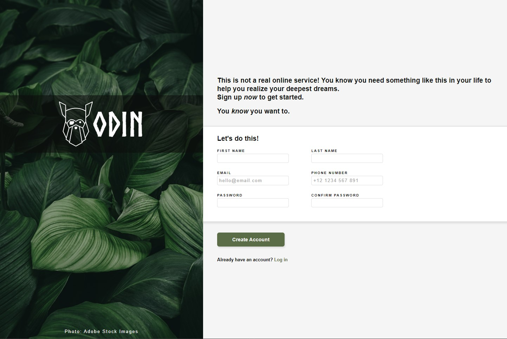

# Custom Sign-Up-Form
A custom sign-up form created as part of **The Odin Projects** Full Stack Engineering Course.

Best viewed on a Chrome browser, unsuitable for a mobile device.

## Project Objectives:

* Build an HTML form using the correct syntax.
* Style the form using CSS.
* Use JavaScript validation.
* Use Git version control.
* Use command line.
* Develop locally on your computer.

***

## Features:
* Focus border for selected fields.
* Password missmatch error text and border.
* Password match validation.
* Pop up displaying entered details.

## Software & SKills:
* 
* 
* 
* 
* 
* 
* 

###### Badges from **Simply Badges** 
